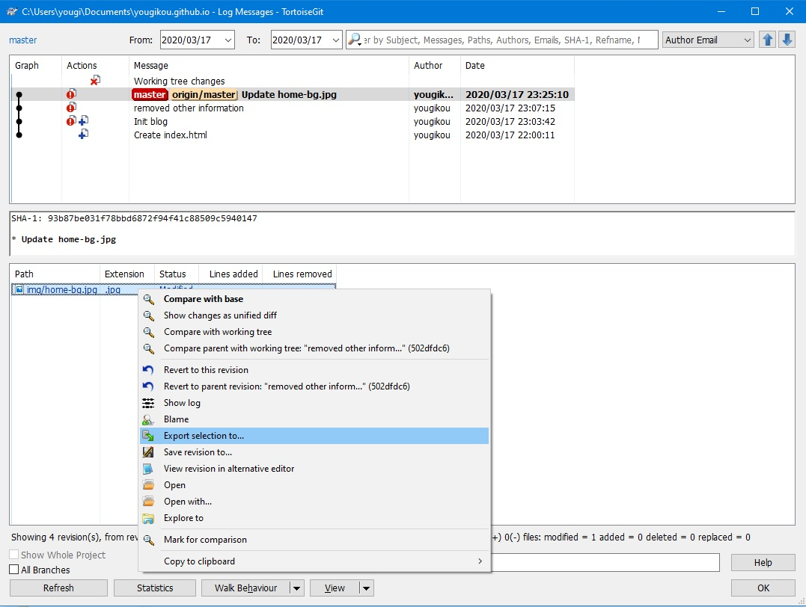
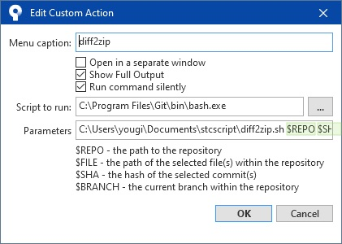

### 背景

工作上用了一段时间的 Git, 虽然同事都推荐直接用命令行, 无奈我这个人还是喜欢看 UI. 而且在 SVN 时代, 抽取两次提交的变更文件是非常惯用的操作, 切换到 Git 之后一直为如何实现这个命令耿耿于怀. 虽然看了有各种方式可以实现, 但是始终没到自己惯用的方式.
最近发现新思路, 于是就整理一下, 方便大家 Google.

### 一些通常能 Google 到的方法

1. TortoiseGit 内建了一个在 log 画面中选择文件后抽取的功能
   
   这个功能对于抽取单次提取的文件很方便, 但是多次累计就用不上了, 在 log 画面选两个 commit 完全和 svn 不一样干脆就看不到文件了. 虽然网上有文章介绍这个小技巧, 但是因为这个原因, 所以...不完美.

2. Windows batch
   我曾一度使用, 是一个日本人写的. 原理就是用 git diff 出来的结果放入循环, 一个一个拷贝出来.
   可以设置到 SourceTree 的 Custom Actions 中直接使用.
   这个人的 blog 我现在也找不到, 就不贴了. 而且这个方法有个弊病!
   在 Windows 环境下, 文件路径是有长度限制的, 在很多项目中文件夹太多层的话, 就会出现找不到文件的问题.
   当然从 Windows 10 开始通过策略组可以取消这个限制 - 但是也就证明了在环境不通用的情况下不是每个人都能成功配置,所以...不完美.

3. Shell script
   Git diff $sha1 $sha2 --name-only | xargs tar -zcvf update.tar.gz 这个方法是命令行, linux 中最通用的.
   的确很好使, Windows 环境下安装 Git 自带的 Linux 工具命令后, 使用起来一点问题没有.
   但是就是每次得拷贝 SHA 值比较费神, 另外 tar 的压缩方式在 Windows 下总觉得别扭, 解压得 2 次...不完美

4. SourceTree 原生的功能就更不用提了, 只能 Archive 真个项目状态, 太费事费力.

### 几个关键以及解决方式

1. 如何从 GUI 操作传入选中的 SHA 值
   SourceTree 的 Custom Actions 提供了这点, 可以传递\$SHA 给 Script.

2. 如何让 SourceTree 的 Custom Actions 执行 bash 的 shell scrip
   这个点是最重要的关键, 但是我在找这个解决方案的时候, 没有文章提及这点, 还是瞎猫碰死耗子在一片完全不相关的文章中找到了答案. 配置如下, Git 是大家都会装的东西, bash 自动附带.
   

3. 这样我们就可以在 Windows 下用方便的 shell command 抽取两次提交的变更文件, 同时打包.
   但是还有一个问题就是如何打包成 zip, Windows 自身没有带这方面的命令. 而 Git 的 linux 工具包 unzip, tar 都带了, 唯独 zip 这个东西没带. (我在调查这个的时候有段小插曲, 我两台电脑, 一台有 zip 命令, 一台没有. 一开始我搞不懂我装了什么不一样的东西造成了这个差异, 花了好长时间才发现 Oracle 数据库安装目录的 bin 里面居然带了 zip.exe...好吧)

   关键我在网上除了找得到这个项目(Info-ZIP)的代码, 居然找不到编译好的 zip.exe,拷贝来用. 有需要的朋友可以直接在这里下([zip.exe.zip](../attached/zip.exe.zip)).
   放到 Git 安装文件夹的那个 linux 工具包路径(Git\usr\bin)里就可以像其他命令一样直接使用.

   下面就是 shell 本身, 其实搞明白就没啥大不了的. 有需要就参考一下.

   _\$Repo 不是必须的, SourceTree 中执行时当前文件夹自动为项目根目录._

   ```shell
      # use parameter -> $REPO $SHA
      repo=""
      sha1=""
      sha2=""
      if [ -n "$1" ] && [ -n "$2" ] && [ -n "$3" ] && [ -z "$4" ]; then
      repo=$1
      sha1=$3
      sha2=$2
      echo "Repository is ${1}."
      echo "Current path is ${PWD}."
      echo $2
      echo $3
      # git diff --diff-filter=ACM $sha1 $sha2 --name-only | xargs tar -czvf update.tar.gz
      git diff --diff-filter=ACM $sha1 $sha2 --name-only | xargs zip -r ./update.zip
      else
      echo "please select two commit"
      fi
      exit
   ```

补充: 添加--diff-filter=ACM 把变更限定为添加更改的文件, 因为删除的文件在打包时自然会找不到. 可以看 log 或者添加这个 option 事先除去.

不知道向我这样还是用 Windows 做主要开发环境, 又有上述需求的朋友是否很多, 我找了很久找不到一个完美方案, 这个方法是自我觉得比较完善的, 给有需要的朋友参考.
十多年没码字, 写这么一点就有点累了:-O
